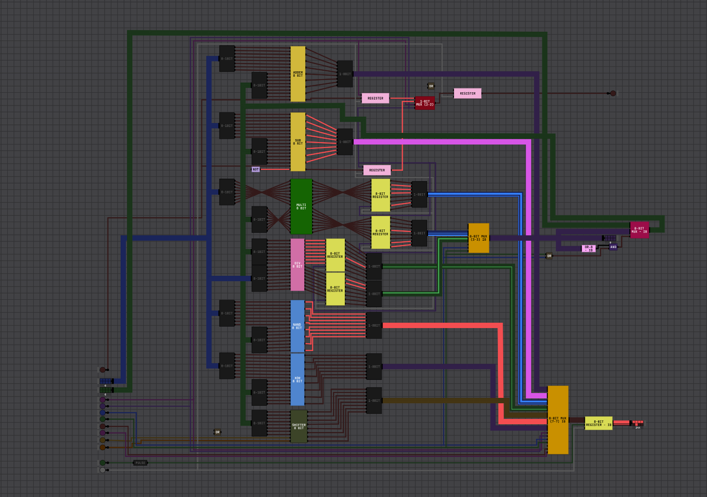

# ALU-8-BITS CAUA PIRILO ASQUINO

Projeto de uma Unidade Lógica e Aritmética (ALU) de 8 bits desenvolvida no DIGITAL SIM, contemplando as operações solicitadas na ponderada:

- Adição
- Subtração
- Multiplicação
- Divisão
- NAND
- XOR
- Shifter (deslocamento para cima e para baixo)

SEGUE VIDEO DA ALU PRONTA:

- https://youtu.be/IiGSSmKs2LY

## Objetivo

Construir uma ALU capaz de receber dois operandos de 8 bits e executar operações aritméticas e lógicas por meio de sinais de controle, retornando o resultado em barramento de 8 bits e, quando aplicável, carry out.

## Estrutura do Projeto

- `ALU.json`: circuito principal da ALU de 8 bits.
- `README.md`: documentação do projeto.

## Blocos Internos da ALU

O circuito principal integra os seguintes submódulos de 8 bits:

- `ADDER 8 BIT`
- `SUB 8 BIT`
- `MULTI 8 BIT`
- `DIV 8 BIT`
- `NAND 8 BIT`
- `XOR 8 BIT`
- `SHIFTER 8 BIT`

Além desses blocos, o projeto utiliza multiplexadores e registradores para selecionar/armazenar o resultado final.

Também fazem parte da arquitetura os seguintes componentes auxiliares:

- Registradores de 1 bit e 8 bits (`REGISTER`, `8-BIT REGISTER` e `8-BIT REGISTER - I8`) para armazenamento intermediário e saída.
- Multiplexadores para seleção de dados e de caminho de resultado (`1-BIT MUX (2-2)`, `8-BIT MUX (3-3) I8`, `8-BIT MUX (7-7) I8` e `8-BIT MUX - I8`).
- Blocos de adaptação/distribuição de barramento (`8-1BIT` e `1-8BIT`) para organização dos sinais entre módulos.
- Portas lógicas de apoio (`OR`, `AND`, `NOT` e `OR-8 - I8`) para habilitação e combinação de sinais de controle.
- Bloco de pulso (`PULSE`) integrado ao controle de armazenamento.

## Entradas

Conforme definido no circuito:

- `AC` (8 bits): operando A
- `N` (8 bits): operando B
- `C-IN` (1 bit): carry in para operação aritmética
- `ADDER` (1 bit): habilita caminho de soma
- `SUB` (1 bit): habilita caminho de subtração
- `MULTI` (1 bit): habilita caminho de multiplicação
- `DIV` (1 bit): habilita caminho de divisão
- `NAND` (1 bit): habilita caminho de NAND
- `XOR` (1 bit): habilita caminho de XOR
- `SHIFT UP` (1 bit): controla deslocamento para a esquerda no shifter
- `SHIFT DOWN` (1 bit): controla deslocamento para a direita no shifter
- `STORE-IN` (1 bit): habilita armazenamento em registrador de saída
- `CLOCK` (1 bit): clock para os registradores

## Saídas

- `OUT` (8 bits): resultado da operação selecionada
- `C-OUT` (1 bit): carry out

Observação: no circuito existe também uma segunda saída de 8 bits identificada como `OUT`, ligada ao bloco de armazenamento/monitoramento.

## Seleção de Operações

A seleção da operação é feita por sinais de controle dedicados. A forma esperada de uso é habilitar apenas uma operação por vez (lógica one-hot), evitando conflitos entre caminhos ativos.

Resumo das operações:

- `ADDER = 1`: `OUT = AC + N (+ C-IN)`
- `SUB = 1`: `OUT = AC - N`
- `MULTI = 1`: `OUT = AC * N`
- `DIV = 1`: `OUT = AC / N` (quociente inteiro)
- `NAND = 1`: `OUT = ~(AC & N)`
- `XOR = 1`: `OUT = AC ^ N`
- `SHIFT UP = 1`: desloca bits para a esquerda
- `SHIFT DOWN = 1`: desloca bits para a direita

## Casos de Teste Sugeridos

- Soma: `AC = 00001010`, `N = 00000011` -> `OUT = 00001101`
- Subtração: `AC = 00001010`, `N = 00000011` -> `OUT = 00000111`
- NAND: `AC = 11110000`, `N = 10101010` -> `OUT = 01011111`
- XOR: `AC = 11110000`, `N = 10101010` -> `OUT = 01011010`
- Shift up: `AC = 00001111` -> `OUT = 00011110`
- Shift down: `AC = 00001111` -> `OUT = 00000111`

